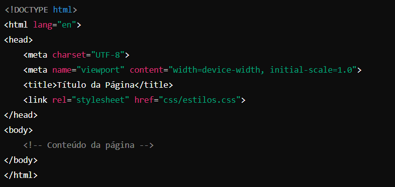

<h1>HTML e CSS: Ambientes de Desenvolvimento, 
Estrutura de Arquivos e Tags</h1>
<h2>Ambientes de Desenvolvimento</h2>

Desenvolver em HTML e CSS pode ser feito em uma variedade de ambientes, desde simples editores de texto até ambientes de desenvolvimento integrado (IDEs) mais complexos.Algumas opções populares incluem:

<ul>
<li>Editores de Texto Simples: Notepad (Windows), TextEdit (Mac), Gedit (Linux).</li>
<li>Editores de Código: Visual Studio Code, Sublime Text, Atom.</li>
<li>IDEs: WebStorm, Adobe Dreamweaver.</li>
</ul>

Esses ambientes oferecem recursos como destaque de sintaxe, auto-completar, pré-visualização em tempo real e depuração, o que facilita o desenvolvimento web.

<h2>Estrutura de Arquivos</h2>

A estrutura de arquivos em um projeto web geralmente segue uma organização hierárquica para manter tudo organizado. Um exemplo típico de estrutura pode ser:

<pre><code>
/meu-projeto
    /css
        estilos.css
    /js
        scripts.js
    /images
        logo.png
    index.html

 </code></pre>

 <ol>
 <li>index.html: O arquivo principal HTML que contém a estrutura básica da página.</li>
  <li>/css: Pasta que armazena arquivos CSS para estilização.</li>
   <li>/js: Pasta que contém arquivos JavaScript.</li>
   <li>/images: Pasta para armazenar imagens.</li>
</ol>

<h2>Tags HTML</h2>

HTML (HyperText Markup Language) utiliza uma série de tags para definir a estrutura do conteúdo web. Algumas das tags mais comuns incluem:

<h3>Estrura básica</h3>

<h2>Tags de Conteúdo</h2>
<ol>
<li> h1 até h6 são tags de Cabeçalhos, com o h1  sendo o mais importante.</li>
<li> p: Parágrafos.</li>
<li> a : Links.</li>
<li> img : Imagens.</li>
<li> div : Divisões genéricas de conteúdo.</li>
<li> span : Elementos em linha para estilização.</li>
</ol>

<h2>CSS</h2>

CSS (Cascading Style Sheets) é utilizado para estilizar elementos HTML. As regras CSS são aplicadas através de seletores que definem quais elementos HTML devem ser estilizados e como.

<pre><code>
body {
    font-family: Arial, sans-serif;
    background-color: #f0f0f0;
    color: #333;
}

h1 {
    color: #0066cc;
}

p {
    line-height: 1.6;
}

 </code></pre>